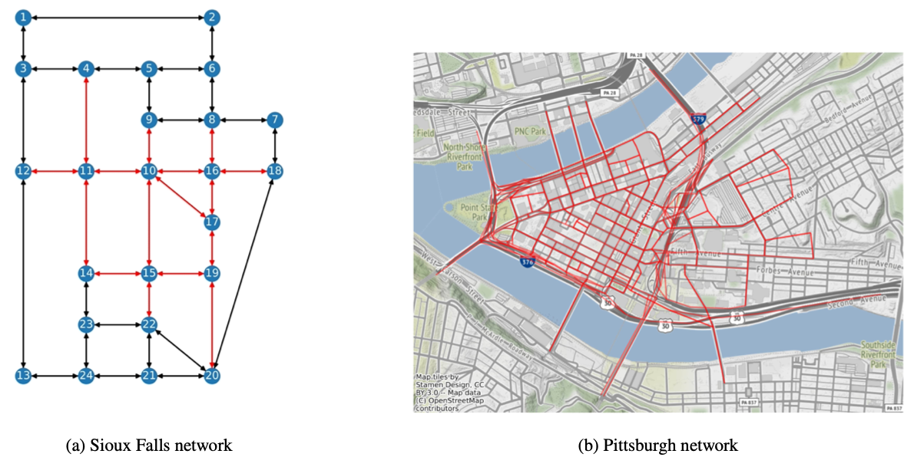
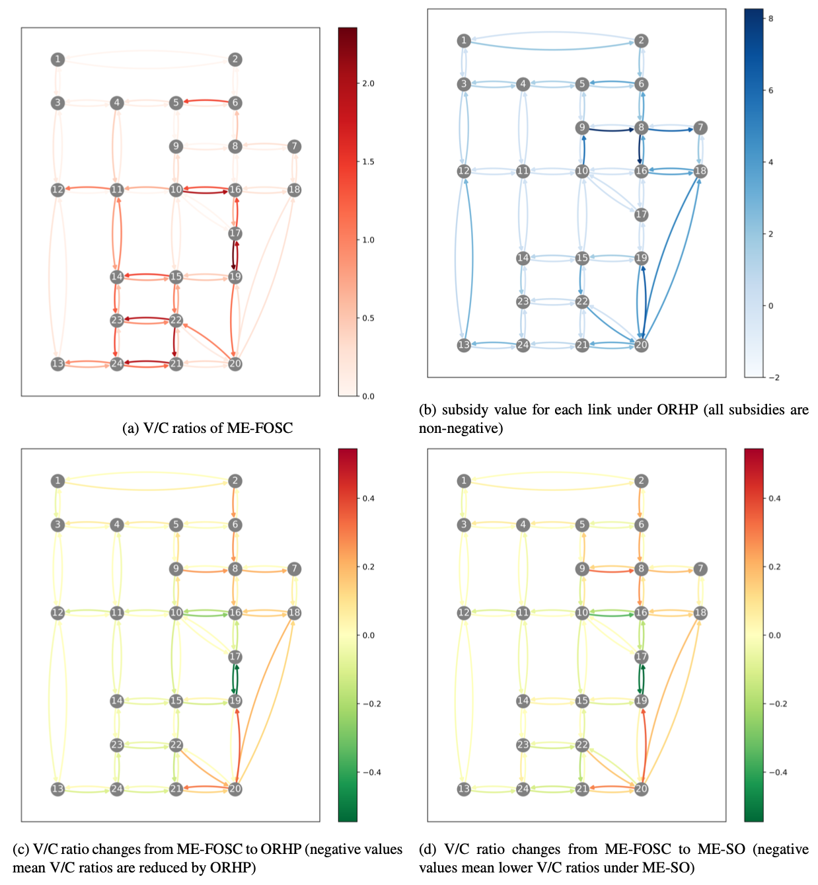

# Optimal Ride Hailing Pricing for Less Congested Roads
## Introduction
This repository implements algorithms, fleet travel behaviors, and a pricing scheme in our paper [Leveraging ride-hailing services for social good: Fleet optimal routing and system optimal pricing](https://www.sciencedirect.com/science/article/pii/S0968090X23002735) published on a top-tier transportation research journal [Transportation Research Part C: Emerging Technologies](https://www.sciencedirect.com/journal/transportation-research-part-c-emerging-technologies). Experiments are conducted on two networks, including the Sioux Falls network and the Pittsburgh network.

<figure>
  
  <figcaption>Figure: Networks for experiments.</figcaption>
</figure> <br/><br/>

This repository provides reusable code for practioners and students interested in network equilibria. Aside solving cutting-edge network equilibrium formulations in the paper, this repository implements solving classical network equilibria including the user equilibrium (UE) and the system optimum (SO).  

Moreover, this repository provides source code and data for researchers with research interests of ride-hailing, optimal pricing, vehicle routing, and network equilibrium. 

Firstly, we consider a mixed equilibrium of ride-hailing vehicles and driving vehicles. The driving vehicles follow the UE routing principle, while the ride-hailing vehicles may follow the UE, the SO, the fleet optimal (FO), or the proposed fleet optimal with service constraints (FOSC) routing principle. Note the proposed FOSC fleet routing principle is able to reduce the fleet travel time of ride-hailing vehicles by routing vehicles cooperatively while maintain the fairness among ride-hailing passengers. The following figures plot results of FOSC on the Sioux Falls network.

<figure>
  
  <figcaption>Figure: Ride-haling fleet travel time reduction compared with the UE on the Sioux Falls network. The figure indicates the FOSC is able to reduce the fleet travel time on par with the FO which is optimal for the fleet.</figcaption>
</figure>


<figure>
  
  <figcaption>Figure: Unfairness among ride-hailing passengers on the Sioux Falls network. Loaded unfairness is the ratio of actual experienced travel time to the travel time of the fastest route for the same origin-destination pair. The figure shows the FOSC leads much less unfairness among ride-hailing passengers. In addition, FOSC provides the ride-hailing passengers who detour with monetary or credit compensations.</figcaption>
</figure> <br/><br/>

On top of the mixed equilibrium of driving vehicles and ride-hailing vehicles, we proposed an optimal ride-hailing pricing scheme (ORHP) with subsidy from public agencies to intervene with ride-hailing companies (e.g., Uber and Lyft) aiming at mitigating congestion of the whole network (reducing total travel time of all vehicles), while considering ride-hailing service’s quality and profitability. Our experiments indicate ORHP is able to reduce total travel time by 16,813 hours with a subsidy cost of $38,701 on the Sioux Falls network. The following figure shows how ORHP makes the Sioux Falls network less congested.

<figure>
  
  <figcaption>Figure: V/C ratios and subsidies for all links in the Sioux Falls network, when minimizing the total travel time. (a): V/C ratios measure congestion levels on links, and higher is more congested. (b): ORHP tends to assign subsidies to under-congested links near to over-congested links, so that vehicles are induced from over-congested links to under-congested links. Therefore, the total travel time is reduced by balancing link congestion. (c) and (d): By comparing two plots, we can find ORHP pushes the network towards the optimal state (i.e., ME-SO), and over-congested links are less congested under ORHP.  </figcaption>
</figure> <br/><br/>

For more details, we refer to our paper [Leveraging ride-hailing services for social good: Fleet optimal routing and system optimal pricing](https://www.sciencedirect.com/science/article/pii/S0968090X23002735).

## Requirements
This repo should be run on `Python==3.8.8` with following packages.
- `numpy==1.20.1`
- `matplotlib==3.3.4`
- `sympy==1.8`
- `networkx==2.5`
- `geopandas==0.10.2`
- `scipy==1.6.2`

## Basic WorkFlow
To implement this repo, you need to clone the repo to your machine, and then install packages as required in the `Requirements` section.

This repo supports solving network equilibria, solving optimal pricing with equilibrium constraints, and results visualization on the Sioux Falls network and the Pittsburgh network.

### Solve network equilibria
Currently, network equilibria supported by the repo include the user equilibrium (UE), the system optimum (SO), and various mixed equilibrium (ME). You can use the following command in your terminal.

```python example_run_ME.py {network} {equilibrium_type}```

where argument `network` should be one in `['SiouxFalls', 'PGH']`, and argument `equilibrium_type` should be one in the following

- `'ME-FO'`: Mixed equibrium of driving vehicles following UE and ride-hailing vehicles following FO.
- `'ME-SO'`: Mixed equibrium of driving vehicles following UE and ride-hailing vehicles following SO.
- `'ME-FOSC'`: Mixed equibrium of driving vehicles following UE and ride-hailing vehicles following FOSC.
- `'Baseline-SO'`: A baseline where all vehicles follow SO.
- `'Baseline-UE'`: A baseline where all vehicles follow UE.

### Solve optimal pricing problems with equilibrium constraints
The repo is able to solve ORHP on top of ME-FOSC by using command line.

```python example_run_ORHP.py {network}```

where argument `network` should be one in `['SiouxFalls', 'PGH']`. Note this will run ORHP with different gammas that measure a trade-off between total travel time reduction and subsidy cost, and smaller gamma means larger total travel time reduction.

### Results visualization
You can use this repo to plot results of network equilibria and optimal pricing after running corresponding experiments. Specifically, `Result_visualization_SiouxFalls_network.ipynb` includes code for plotting results of the Sioux Falls network, and `Result_visualization_Pittsburgh_network.ipynb` is for the Pittsburgh network.


## Repository Structure
The structure of this repository and descriptions of files are as follows.
``` 
Data  // input data and output data
   |-- Networks
   |   |-- Pittsburgh
   |   |   |-- output  // output files
   |   |   |-- shpfiles  // shapefiles for Pittsburgh network
   |   |   |-- splitted_demands_downtown_factor_1  // driving demands and ride-hailing demands with downtown factor of 1
   |   |   |-- splitted_demands_downtown_factor_2  // driving demands and ride-hailing demands with downtown factor of 2
   |   |   |-- pitts_net_new_0716.tntp.txt  //  link data of the Pittsburgh network
   |   |   |-- pitts_path_sets_new_0716.tntp.txt  //  path sets
   |   |   |-- pitts_trips_new_0716.tntp.txt  //  total travel demands
   |   |-- SiouxFalls
   |   |   |-- output  // output files
   |   |   |-- splitted_demands_downtown_factor_1  // driving demands and ride-hailing demands with downtown factor of 1
   |   |   |-- splitted_demands_downtown_factor_2  // driving demands and ride-hailing demands with downtown factor of 2
   |   |   |-- SiouxFalls_net.tntp  //  link data of the Sioux Falls network
   |   |   |-- SiouxFalls_node.tntp  //  node coordinates of the Sioux Falls network
   |   |   |-- SiouxFalls_path_sets.tntp  //  path sets
   |   |   |-- SiouxFalls_trips (GA).tntp  //  total travel demands
src  // source code
   |-- generate_driving_ridehailing_demands.py  // generate driving and ride-hailing demands based on total demands
   |-- ME.py  //  function for solving mixed equilibria
   |-- Network.py  //  a versatile class for network analysis, including traffic assignments, mixed equilibria, and ORHP
   |-- Node_Link.py  //  a node class and a link class
   |-- ORHP.py  //  functions solving ORHP using a sensitivity analysis-based algorithm
example_run_ME.py  //  an example for solving the user equilibrium, the system optimum, and various mixed equilibria
example_run_ORHP_with_different_initial_points.py  // an example for solving ORHP with different initial points
example_run_ORHP.py  // an example for solving ORHP with different gammas (trade-off between travel time reduction and subsidy cost)
Result_visualization_Pittsburgh_network.ipynb  //  plots for the Pittsburgh network
Result_visualization_SiouxFalls_network.ipynb  //  plots for the Sioux Falls network
```

## Contacts
Zemian Ke (zemiank@andrew.cmu.edu, kezemian@gmail.com), Sean Qian (seanqian@cmu.edu)

## Citation
```
@article{ke2023leveraging,
  title={Leveraging ride-hailing services for social good: Fleet optimal routing and system optimal pricing},
  author={Ke, Zemian and Qian, Sean},
  journal={Transportation Research Part C: Emerging Technologies},
  volume={155},
  pages={104284},
  year={2023},
  publisher={Elsevier}
}
```
